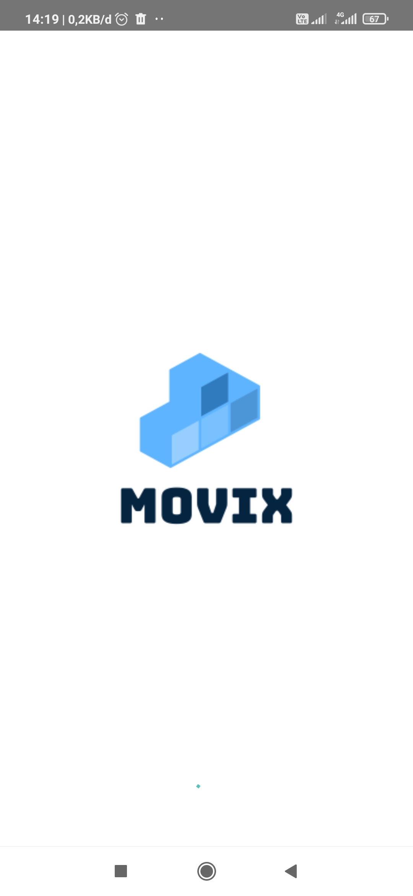
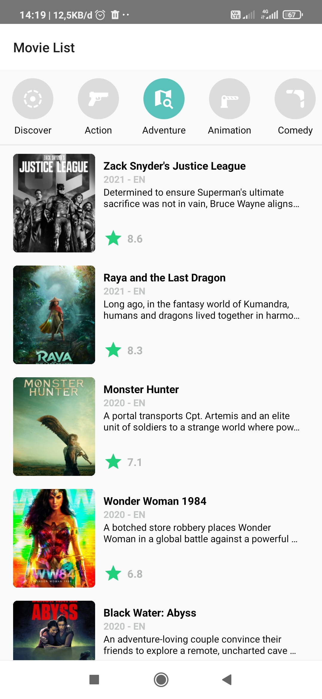
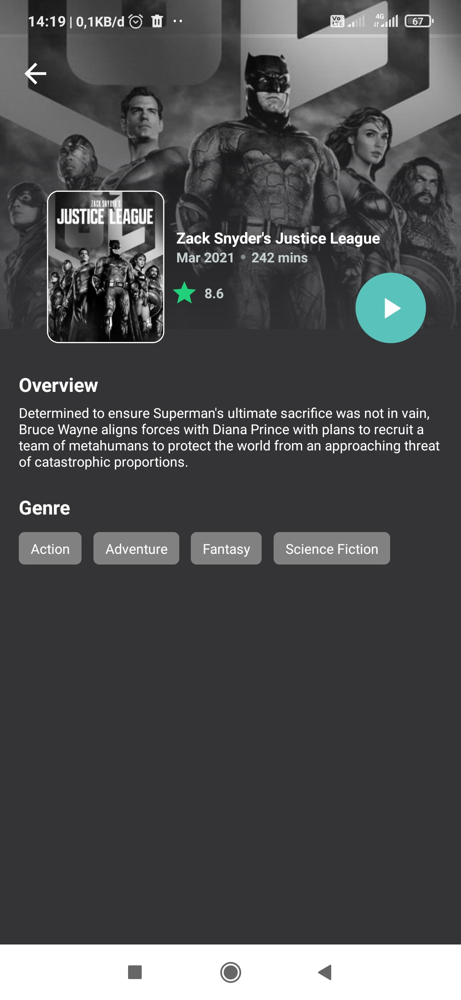

<h1 align="center">Movix</h1>

  

  Built with React Native

## Table of Contents

- [Screenshots](#screenshots)
- [Release APK](#release-apk)
- [Contact](#contact)
- [Contributors](#contributors)

## Screenshots

       
    

       
    

## Release APK

## Contact

If you want to contact me you can reach me at <nihsan727@gmail.com>.

Copyright © 2020 by Nur Ihsan

## Contributors

  <table>
    <tr>
      <td align="center">
        <a href="https://github.com/ihsan2">
           
          <b>Nur Ihsan</b>
        </a>
      </td>
    </tr>
  </table>

